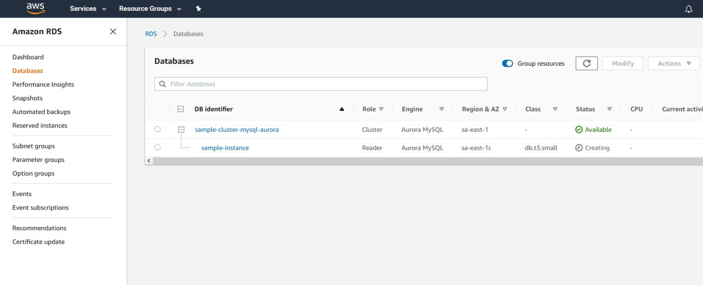
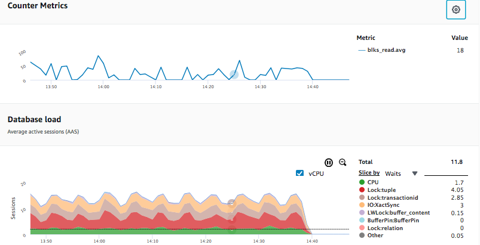
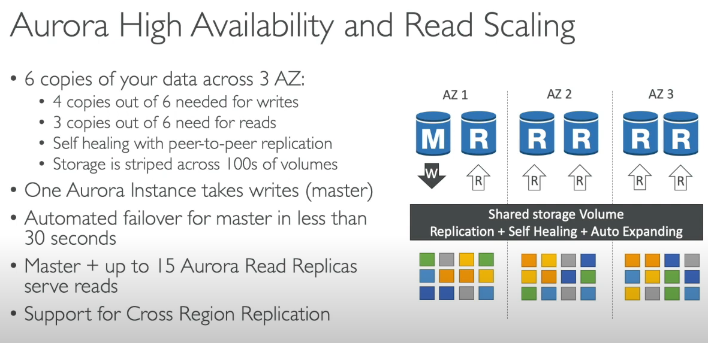

# Amazon Aurora

## O que é?

Servidor de banco de dados relacional

Possui um sistema de armazenamento distribuído 

## Pra que serve?

Gerenciamento dos dados na

## Vantagens

- Altos níveis de performance e escalabilidade
- **HA** (Alta Disponibilidade) e resiliência
- Backup contínuo para **Amazon S3**
- Recuperação **point-in-time**
- Replicação em três **AZ**s (Zonas de Disponibilidade)
- Gerenciado pelo **Amazon RDS** (Relational Database Service)
- Compatível com **MySQL** e **PostgreSQL**
- Sistema de armazenamento distribuído
- **AWS Cloud Optimized**
    - **5x** o throughput do **MySQL**
    - **3x** a throughput do **PostgreSQL**
- **MySQL** tem um limite de **5** réplicas, euquanto Aurora pode ter **15**
    - **15** réplicas de leitura de baixa latência
- **Failover** (tolerância a falhas) é instantânea, é nativamente **HA**
- Aurora é mais caro que o **Amazon RDS** (20% há mais) — mas é mais eficiente

## Como funciona?

Aurora se expande automaticamente em incrementos de 10GB, até 128TB

## Preços

Aurora é propriedade tecnológica da AWS (não é open-source), portanto, eles cobram de acordo com a utilização

### Instâncias de banco de dados

---
**Leste dos EUA (Ohio)**

Instâncias padrão – Geração atual | Preço por hora
------------ | -------------
db.t3.small	 | 0,041 USD
db.t3.medium | 0,082 USD

---
**América do Sul (São Paulo)**

Instâncias padrão – Geração atual | Preço por hora
------------ | -------------
db.t3.small	 | 0,084 USD
db.t3.medium | 0,168 USD

### Armazenamento de banco de dados e I/Os

---
**Leste dos EUA (Ohio)**

Taxa de armazenamento | 0,10 USD por GB/mês
------------ | -------------
Taxa de E/S  | 0,20 USD por 1 milhão de solicitações

---
**América do Sul (São Paulo)**

Taxa de armazenamento | 0,19 USD por GB/mês
------------ | -------------
Taxa de E/S	| 0,28 USD por 1 milhão de solicitações

## Quem usa?

- **Netflix**
    - Netflix is the world's leading internet entertainment service with over 130 million memberships in over 190 countries enjoying TV series, documentaries and feature films across a wide variety of genres and languages.
    - “We were able to test Aurora’s parallel query feature and the performance gains were very good. To be specific, for queries doing full table scan or fetching fat indexes with billions of rows, we noticed the query time reduced from 32 minutes to 3 minutes. We were able to reduce the instance type from r3.8xlarge to r3.2xlarge. For this use-case, parallel query was a great win for us.” — **Jyoti Shandil, Cloud Data Architect - Netflix**
- **Samsung**
    - Samsung moved over a billion users across three continents from Oracle to Amazon Aurora, improving latency and scalability while lowering monthly costs.

## Exemplos

## Referências

- Amazon Aurora Introduction. Available at: https://www.youtube.com/watch?v=ZCt3ctVfGIk
- Introduction to Amazon Aurora - Relational Database Built for the Cloud - AWS. Available at: https://www.youtube.com/watch?v=FzxqIdIZ9wc
- When Should I Use Amazon Aurora and When Should I use RDS MySQL? Available at: https://www.percona.com/blog/2018/07/17/when-should-i-use-amazon-aurora-and-when-should-i-use-rds-mysql/