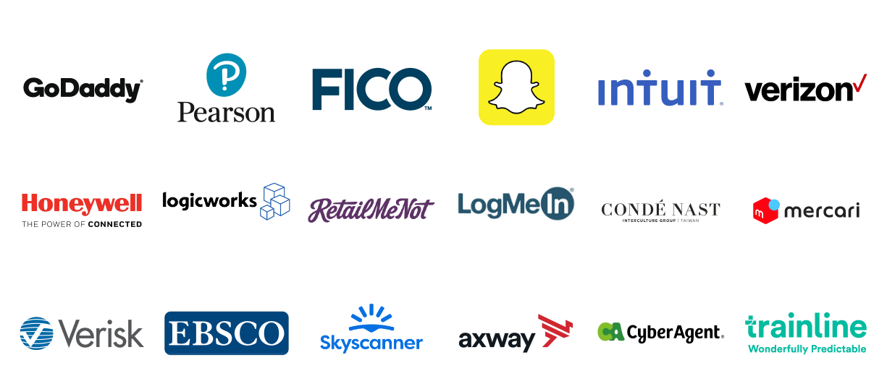
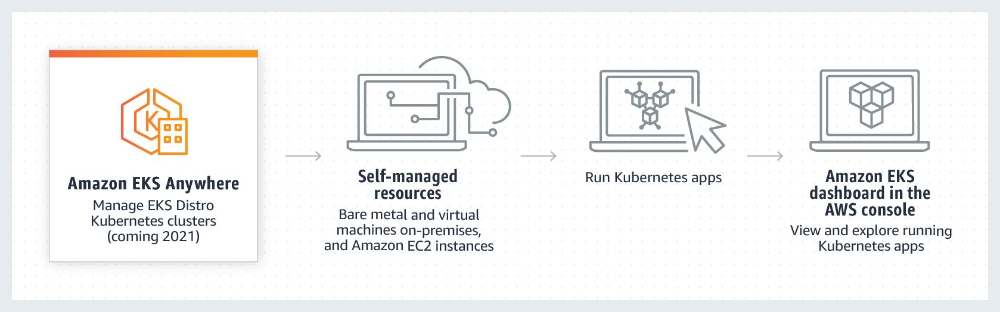
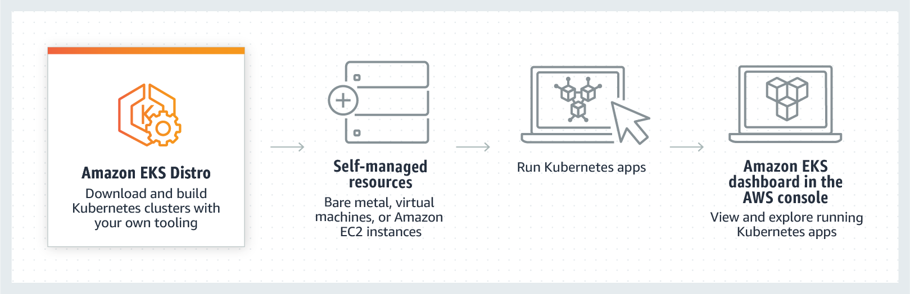
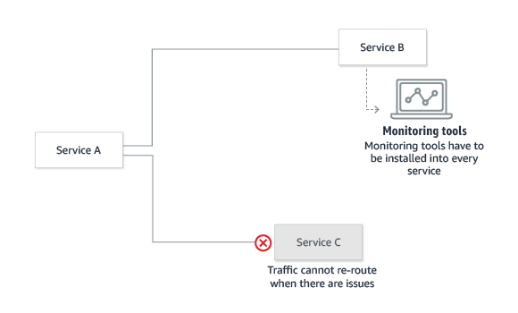
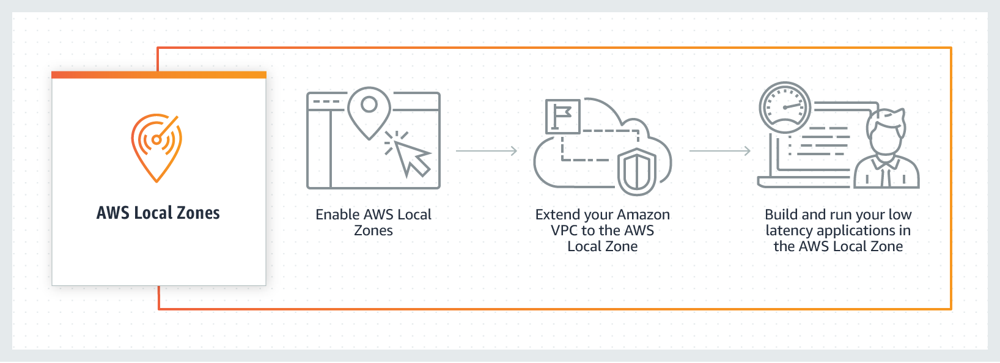
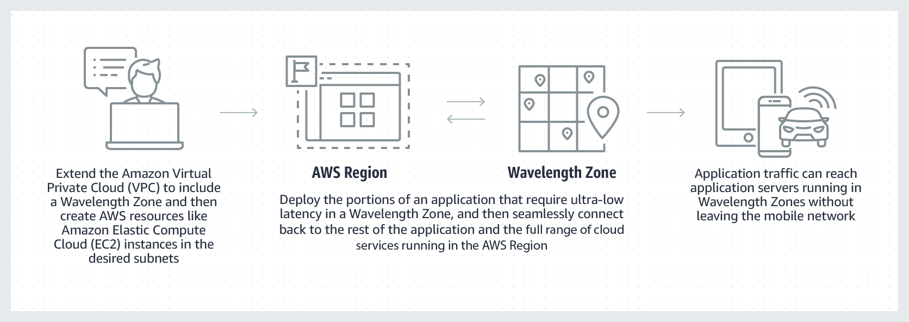
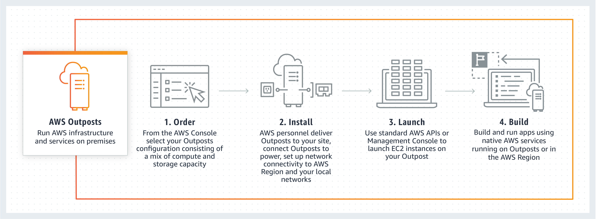

# Kubernetes

## Serviço

Amazon EKS (Amazon Elastic Kubernetes Service)

## Destaques

- segurança
- confiabilidade
- escalabilidade

## Quem usa?

- Intel
- Snap
- Intuit
- GoDaddy
- Autodesk
- LogMeIn

## Aplicação

Pode ser usado em:

- AWS **EC2** (Amazon Elastic Compute Cloud)
- AWS **Fargate**

## Como ele funciona

Implante aplicativos com Amazon EKS na Cloud

Implante aplicativos com Amazon EKS Anywhere

Implante aplicativos com suas próprias ferramentas

## Serviços Complementares

### Application Load Balancer

Load balance HTTP and HTTPS traffic with advanced request routing targeted at the delivery of modern applications.

<!-- Application Load Balancer operates at the request level (layer 7), routing traffic to targets (EC2 instances, containers, IP addresses, and Lambda functions) based on the content of the request. Ideal for advanced load balancing of HTTP and HTTPS traffic, Application Load Balancer provides advanced request routing targeted at delivery of modern application architectures, including microservices and container-based applications. Application Load Balancer simplifies and improves the security of your application, by ensuring that the latest SSL/TLS ciphers and protocols are used at all times. -->

### AWS Fargate

Computação sem servidor para contêineres

O Fargate elimina a necessidade de provisionar e gerenciar servidores, permite que você especifique e pague pelos recursos por aplicativo, além de aumentar a segurança ao conceber aplicativos isolados

<!-- O AWS Fargate é um mecanismo de computação sem servidor para contêineres que funciona com o Amazon Elastic Container Service (ECS) e com o Amazon Elastic Kubernetes Service (EKS). O Fargate facilita a sua concentração no desenvolvimento de aplicativos. O Fargate elimina a necessidade de provisionar e gerenciar servidores, permite que você especifique e pague pelos recursos por aplicativo, além de aumentar a segurança ao conceber aplicativos isolados.
O Fargate aloca a quantidade certa de computação, eliminando a necessidade de escolher instâncias e ajustar a escala da capacidade do cluster. Você só paga pelos recursos exigidos para a execução dos contêineres, por isso não há excesso de provisionamento nem pagamento por servidores adicionais. O Fargate executa cada tarefa ou pod no próprio kernel do serviço, disponibilizando às tarefas e aos pods ambientes próprios isolados de computação. Isso permite que o aplicativo seja concebido para oferecer isolamento da carga de trabalho e segurança otimizada. É por isso que clientes, como Vanguard, Accenture, Foursquare e Ancestry, escolheram executar aplicativos de missão crítica no Fargate. -->

#### Como funciona?

### Amazon CloudWatch

Capacidade de observação dos seus recursos da AWS e aplicativos na AWS e no local

<!-- O Amazon CloudWatch é um serviço de monitoramento e observação criado para engenheiros de DevOps, desenvolvedores, Site Reliability Engineers (SREs – Engenheiros de confiabilidade de sites) e gerentes de TI. O CloudWatch fornece dados e insights práticos para monitorar aplicativos, responder às alterações de performance em todo o sistema, otimizar a utilização de recursos e obter uma visualização unificada da integridade operacional. O CloudWatch coleta dados de monitoramento e operações na forma de logs, métricas e eventos, oferecendo uma visualização unificada dos recursos, dos aplicativos e dos serviços da AWS executados na AWS e em servidores locais. Você pode usar o CloudWatch para detectar comportamento anômalo em seus ambientes, definir alarmes, visualizar logs e métricas lado a lado, executar ações automatizadas, resolver problemas e descobrir insights para manter seus aplicativos
em perfeita execução. -->

#### Como funciona?

### AWS Identity and Access Management (IAM)

Gerencie com segurança o acesso aos serviços e recursos da AWS.

<!-- O AWS Identity and Access Management (IAM) permite que você gerencie com segurança o acesso aos serviços e recursos da AWS. Usando o IAM, você pode criar e gerenciar usuários e grupos da AWS e usar permissões para conceder e negar acesso a recursos da AWS.

O IAM é um recurso de sua conta da AWS disponibilizado gratuitamente. Você será cobrado somente pelo uso de outros serviços da AWS utilizados pelos usuários.

Para começar a usar o IAM, ou caso já esteja registrado na AWS, acesse o Console de Gerenciamento da AWS e obtenha conceitos básicos com estas melhores práticas do IAM.  -->

### Amazon Virtual Private Cloud

Provisione uma seção da nuvem AWS logicamente isolada na qual é possível executar recursos da AWS em uma rede virtual que você mesmo define

<!-- A Amazon Virtual Private Cloud (Amazon VPC) permite provisionar uma seção da Nuvem AWS isolada logicamente na qual é possível executar recursos da AWS em uma rede virtual que você mesmo define. Você tem controle total sobre seu ambiente de redes virtuais, incluindo a seleção do seu próprio intervalo de endereços IP, a criação de sub-redes e a configuração de tabelas de rotas e gateways de rede. Você pode usar IPv4 e IPv6 na VPC para acessar recursos e aplicativos com segurança e facilidade.
É possível personalizar facilmente a configuração da rede da Amazon VPC. Por exemplo, você pode criar uma sub-rede voltada ao público para seus servidores Web que têm acesso à Internet. Você também pode colocar seus sistemas back-end, como bancos de dados ou servidores de aplicativos, em uma sub-rede privada, sem acesso à Internet. Você pode usar várias camadas de segurança, incluindo grupos de segurança e listas de controle de acesso à rede, para ajudar a controlar o acesso às instâncias do Amazon EC2 em cada subrede. -->

### AWS App Mesh

Redes de aplicativos para todos os serviços

<!-- O AWS App Mesh é um service mesh que oferece redes para aplicativos a fim de facilitar a comunicação dos serviços entre si e entre vários tipos de infraestrutura de computação. O App Mesh padroniza o modo de comunicação dos seus serviços, oferecendo visibilidade de ponta a ponta e garantindo alta disponibilidade para seus aplicativos.

Aplicações modernas normalmente são compostas por múltiplos serviços. Cada serviço pode ser construído usando vários tipos de infraestrutura de computação, como o Amazon EC2 e o AWS Fargate. À medida que o número de serviços cresce dentro de um aplicativo, torna-se mais difícil identificar a localização exata dos erros, rotear novamente o tráfego em caso de falhas e implantar alterações de código com segurança. Anteriormente, isso exigia que você criasse uma lógica de monitoramento e controle diretamente no código e implantasse novamente o serviço sempre que houvessem alterações.

O AWS App Mesh facilita a execução de serviços, oferecendo visibilidade e controles de tráfego de rede consistentes para serviços criados em vários tipos de infraestrutura de computação. O serviço elimina a necessidade de atualizar o código do aplicativo para alterar a coleta de dados de monitoramento ou o roteamento de tráfego entre os serviços. O App Mesh configura cada serviço para exportar dados de monitoramento e implementa uma lógica de controle de comunicações consistente em todo o aplicativo. Isso facilita a identificação rápida da localização exata dos erros e o novo roteamento automático do tráfego da rede quando há falhas ou quando é necessário implantar mudanças de código.

Você pode usar o App Mesh com o AWS Fargate, o Amazon EC2, o Amazon ECS, o Amazon EKS e o Kubernetes executados na AWS para executar melhor seu aplicativo em escala. O App Mesh também integra-se com o AWS Outposts para os aplicativos executados no local. O App Mesh usa o proxy Envoy de código aberto, tornando-o compatível com uma grande variedade de ferramentas de parceiros da AWS e de código aberto. -->

#### Como funciona?

**Antes do App Mesh**

As comunicações e o monitoramento são configurados manualmente para cada serviço.

**Depois do App Mesh**

O App Mesh configura a comunicação e o monitoramento de todos os serviços.

### Zonas locais da AWS

Execute aplicativos com requisitos rigorosos de latência mais perto dos usuários

<!-- Zonas locais da AWS são um novo tipo de implantação de infraestrutura da AWS que coloca os serviços de computação, armazenamento, banco de dados e outros serviços seletos da AWS mais perto do público em geral, do setor e dos centros de TI onde não há Região da AWS. Com as zonas locais da AWS, você pode facilmente executar trechos das aplicações com requisitos rigorosos locais de latência para usuários finais e recursos em determinada localidade, com latência inferior a 10 milissegundos para casos de uso como criação de conteúdo de mídia e entretenimento, jogos em tempo real, simulações de reservatórios, automação de projetos eletrônicos e machine learning.

Toda localidade em uma Zona local da AWS é uma extensão de uma Região da AWS, onde é possível executar aplicativos que têm requisitos rigorosos de latência com serviços da AWS, como Amazon Elastic Compute Cloud, Amazon Virtual Private Cloud, Amazon Elastic Block Store, Amazon FSx, Amazon Elastic Load Balancing, Amazon EMR, Amazon ElastiCache, Amazon Elastic Kubernetes Service, Amazon Elastic Container Service, and Amazon Relational Database Service na proximidade geográfica dos usuários finais. Zonas locais da AWS oferecem alta largura de banda, conexão segura entre as cargas de trabalho locais e as executadas na Região da AWS. Com isso, você pode facilmente retomar a conexão com outras cargas de trabalho em execução na AWS e com todos os tipos de serviços na região usando as mesmas APIs e conjuntos de ferramentas.

As Zonas locais da AWS têm gerenciamento e suporte da AWS. Assim você pode usufruir de todos os benefícios de elasticidade, escalabilidade e segurança da nuvem. Com as zonas locais da AWS, você pode criar e implantar facilmente aplicações com requisitos rigorosos de latência para os usuários utilizando um conjunto consistente de serviços da AWS, além de poder expandir, reduzir e pagar somente pelos recursos que usar.

As zonas locais da AWS estão normalmente disponíveis em Los Angeles e outras zonas locais estarão disponíveis em breve.
Comece a usar as zonas locais da AWS aqui. -->

#### Como funciona?

### AWS Wavelength

Entregue aplicativos de latência ultra-baixa para dispositivos de 5G

<!-- O AWS Wavelength é uma oferta de infraestrutura da AWS otimizada para aplicativos de computação de borda móvel. As Zonas do Wavelength são implantações de infraestrutura da AWS que incorporam serviços de computação e armazenamento da AWS aos datacenters dos provedores de serviços de comunicação (CSP) na borda da rede 5G, para que o tráfego de aplicativos de dispositivos 5G possa acessar os servidores de aplicativos em execução nas Zonas do Wavelength sem sair da rede de telecomunicações. Isso evita que a latência, que resultaria do tráfego de aplicativos, tenha que atravessar vários saltos pela Internet para chegar ao seu destino, permitindo que os clientes aproveitem ao máximo os benefícios de latência e largura de banda oferecidos pelas redes 5G modernas. -->

#### Como funciona?

### AWS Outposts

Execute a infraestrutura e os serviços da AWS no local para ter uma experiência híbrida verdadeiramente consistente

<!-- O AWS Outposts é um serviço gerenciado que oferece a mesma infraestrutura, os serviços, as APIs e as ferramentas da AWS a praticamente qualquer datacenter, espaço de colocalização ou instalação on-premises para oferecer uma experiência híbrida verdadeiramente consistente. O AWS Outposts é ideal para cargas de trabalho que exigem acesso de baixa latência a sistemas locais, processamento de dados local, residência de dados e migração de aplicativos com interdependências do sistema local.

Serviços da AWS, como computação, armazenamento e banco de dados, são executados localmente em Outposts, e você pode acessar toda a gama de serviços da AWS disponíveis na Região para criar, gerenciar e dimensionar suas aplicações locais usando serviços e ferramentas conhecidas da AWS.

Em breve, em 2020, uma variante da VMware do AWS Outposts estará disponível. O VMware Cloud on AWS Outposts oferece um VMware Defined Data Center (SDDC) totalmente gerenciado em execução na infraestrutura local do AWS Outposts. -->

#### Como funciona?

